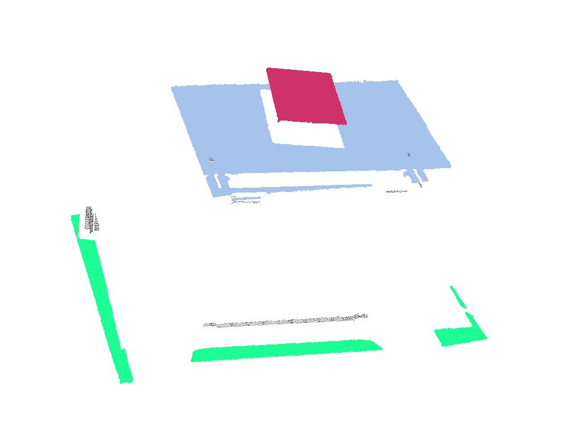

# Multiple Planes Detection

A fast and simple method for multi-planes detection from point clouds using iterative RANSAC plane fitting.

## Pre-requisite
- Python >= 3.5
- Numpy
- Open3D >= 0.16.0 

**(Since Open3D 0.16.0, the ransac plane fitting is parallel using openmp. If you use older versions, it can run but the speed would be slow.)**

You can install numpy and open3d by:
```
pip3 install -r requirements.txt
```

## Usage
You can copy the functions in `utils.py` and `plane_detection.py` into your Python script and use function `DetectMultiPlanes` directly.

An example code can be found by running:
```
python3 plane_detection.py
```

## Results


